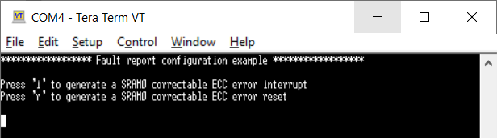
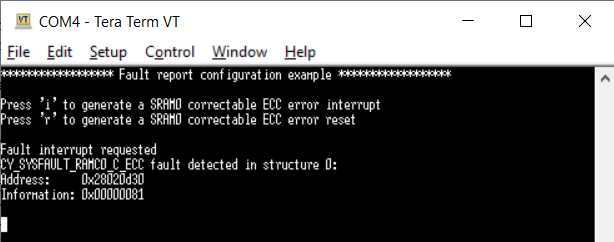
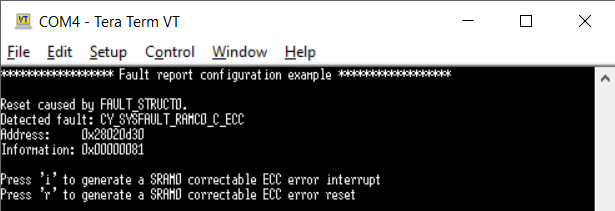

# FAULT REPORT Configuration
**This code example shows how to configure the fault subsystem and describes its operation.**  

## Device
The device used in this code example (CE) is:
- [TRAVEO™ T2G CYT4BF Series](https://www.infineon.com/cms/en/product/microcontroller/32-bit-traveo-t2g-arm-cortex-microcontroller/32-bit-traveo-t2g-arm-cortex-for-body/traveo-t2g-cyt4bf-series/)

## Board
The board used for testing is:
- TRAVEO™ T2G evaluation kit ([KIT_T2G-B-H_EVK](https://www.infineon.com/cms/en/product/evaluation-boards/kit_t2g-b-h_evk/), [KIT_T2G-B-H_LITE](https://www.infineon.com/cms/en/product/evaluation-boards/kit_t2g-b-h_lite/))

## Scope of work
In this example, a correctable error correction code (ECC) error is injected into the memory, causing a fault.

## Introduction  
**Fault Subsystem**  
The fault subsystem contains information about faults that occur in the system. The subsystem can cause a reset, give a pulse indication, or trigger another peripheral. The TRAVEO™ T2G platform uses a centralized fault report structure. The centralized nature allows for a system-wide, consistent handling of faults, which simplifies software development as follows:
- Only a single fault interrupt handler is required
- The fault report structure provides the fault source and additional fault-specific information from a single set of Memory Mapped Input/Output (MMIO) registers; that is, no iterative search is required for the fault source and fault information
- All pending faults are available from a single set of MMIO registers

The fault subsystem captures faults related to, but not limited to:
- MPU/SMPU/PPU protection violations
- Peripheral-specific errors
- Memory controller specific errors, such as SRAM controller ECC errors, flash controller “read-while-program”, and ECC errors
- Processor tightly-coupled memory (TCM) ECC errors
- Timeout errors

Note that some of the above faults also result in errors on the bus infrastructure. These faults are communicated in two ways:
- As a bus error to the master of the faulting bus transfer
- As a fault in a fault report structure. This fault can be communicated as a fault interrupt to any processor in the system.
This allows fault handling on a processor that is not the master of the faulting bus transfer. It is useful for faults that cause the master of the faulting transfer to become unresponsive or unreliable

The fault subsystem only captures faults. It does not take any action to correct it.

More details can be found in [Technical Reference Manual (TRM)](https://www.infineon.com/dgdl/?fileId=5546d4627600a6bc017600bfae720007), [Registers TRM](https://www.infineon.com/dgdl/?fileId=5546d4627600a6bc017600be2aef0004) and [Data Sheet](https://www.infineon.com/dgdl/?fileId=5546d46275b79adb0175dc8387f93228).

## Hardware setup
This CE has been developed for:
- TRAVEO™ T2G evaluation kit ([KIT_T2G-B-H_EVK](https://www.infineon.com/cms/en/product/evaluation-boards/kit_t2g-b-h_evk/)) 
 
No changes are required from the board's default settings.

- TRAVEO™ T2G Body High Lite evaluation kit ([KIT_T2G-B-H_LITE](https://www.infineon.com/cms/en/product/evaluation-boards/kit_t2g-b-h_lite/)) 
 
No changes are required from the board's default settings.

## Implementation
This design consists of one user LED. ECC correctable errors can be generated by using CPUSS ECC injection mechanisms. For this purpose, the CPUSS is configured to cause an ECC error, which is detected and handled by the fault system. Depending on the configuration, an interrupt is caused and processed by the corresponding fault handler, or the system freezes and requires a reset.

**STDIN / STDOUT setting**

Initialization of the GPIO for UART is done in the <a href="https://infineon.github.io/retarget-io/html/group__group__board__libs.html#gaddff65f18135a8491811ee3886e69707"><i>cy_retarget_io_init()</i></a> function.
- Initialize the pin specified by CYBSP_DEBUG_UART_TX as UART TX, the pin specified by CYBSP_DEBUG_UART_RX as UART RX (these pins are connected to KitProg3 COM port)
- The serial port parameters are set to 8N1 and 115200 baud

<a href="https://infineon.github.io/mtb-hal-cat1/html/group__group__hal__uart.html#ga89108b2d339dc9863ec660588e3a4a12"><i>cyhal_uart_getc()</i></a> returns the user input from the terminal as received data.

**LED control**

Initialization of the GPIO port pin is done once in the <a href="https://infineon.github.io/mtb-hal-cat1/html/group__group__hal__gpio.html#gab93322030909d3af6a9fc1a3b2eccbaa"><i>cyhal_gpio_init()</i></a> function.
- Initialize the pin specified by *CYBSP_USER_LED1* as output (initial level = H, LED turns off)

The GPIO is controlled when a fault occurs as a *handle_Fault_IRQ* interrupt.
- The user LED blinks three times with a period of 500 ms, whose level is inverted by <a href="https://infineon.github.io/mtb-hal-cat1/html/group__group__hal__gpio.html#gacf9c6cb7d4f6f25828a62d44648b745d"><i>cyhal_gpio_toggle()</i></a> and the interval is created by <a href="https://infineon.github.io/mtb-hal-cat1/html/group__group__hal__system.html#ga5f450769c1207d98134a9ced39adfdda"><i>cyhal_system_delay_ms()</i></a>.

**Fault detection after reset**

To detect a fault, which requested a reset, a check on *FAULT_STRUCT0->STATUS* is performed during startup. If a fault caused the reset, corresponding information can be displayed using <a href="https://infineon.github.io/mtb-pdl-cat1/pdl_api_reference_manual/html/group__group__sysfault__functions.html#ga140278f2e209ee8dfb39eb1574850742"><i>Cy_SysFault_GetFaultData()</i></a>.

**ECC error injection**

- All the fault initialization is done in *init_Fault()*. This function firstly clears the fault status by calling <a href="https://infineon.github.io/mtb-pdl-cat1/pdl_api_reference_manual/html/group__group__sysfault__functions.html#ga0a2a097b9b1d69fb51806964639c7af7"><i>Cy_SysFault_ClearStatus()</i></a>. Then enable capturing RAM ECC faults by calling <a href="https://infineon.github.io/mtb-pdl-cat1/pdl_api_reference_manual/html/group__group__sysfault__functions.html#gafb1516898b15bdc985a7460c7a9f7ca1"><i>Cy_SysFault_SetMaskByIdx()</i></a> and <a href="https://infineon.github.io/mtb-pdl-cat1/pdl_api_reference_manual/html/group__group__sysfault__functions.html#ga2b7d86c125f4c1d55ffabfecc3b31338"><i>Cy_SysFault_SetInterruptMask()</i></a>.
- if 'i' is pressed, the fault handling is configured to request an interrupt after detection by calling *init_Fault()*, which will call <a href="https://infineon.github.io/mtb-pdl-cat1/pdl_api_reference_manual/html/group__group__sysfault__functions.html#ga883297a5695f829251d11fb1cc6b6b4c"><i>Cy_SysFault_Init()</i></a>, using an interrupt configuration. Afterwards, function *generate_ECC_SRAM0_correctable_error_by_parity()* causes an ECC error to be injected and detected by the fault handler.
- if 'r' is pressed, the fault handling is configured to request a reset after detection by calling *init_Fault()*, which will call <a href="https://infineon.github.io/mtb-pdl-cat1/pdl_api_reference_manual/html/group__group__sysfault__functions.html#ga883297a5695f829251d11fb1cc6b6b4c"><i>Cy_SysFault_Init()</i></a>, using a reset configuration. Afterwards, function *generate_ECC_SRAM0_correctable_error_by_parity()* causes an ECC error to be injected and detected by the fault handler.
- In both cases, the parity values (normal and 1/2-bit error values) of the memory under test (*g_Test*) are calculated by the *generate_Parity()* function. This function calculates the parity value based on the word given as an argument which includes the address and value of *g_Test* calculated by *make_Word_For_Sram_Ecc()*. See [TRM](https://www.infineon.com/dgdl/?fileId=5546d4627600a6bc017600bfae720007) for details on how parity is calculated.
- Finally, *init_Fault()* sets up *handle_Fault_IRQ()* to be called as an interrupt handler when a fault occurs by calling <a href="https://infineon.github.io/mtb-pdl-cat1/pdl_api_reference_manual/html/group__group__sysint__functions.html#gab2ff6820a898e9af3f780000054eea5d"><i>Cy_SysInt_Init()</i></a>, *NVIC_SetPriority()* and *NVIC_EnableIRQ()*.

## Run and Test
For this example, a terminal emulator is required to display outputs and receive keys pressed. You can install a terminal emulator if you do not have one. In this example, [Tera Term](https://ttssh2.osdn.jp/index.html.en) was used as the terminal emulator.

After code compilation, perform the following steps to flash the device:
1. Connect the board to your PC using the provided USB cable through the KitProg3 USB connector.
2. Open a terminal program and select the KitProg3 COM port. Set the serial port parameters to 8N1 and 115200 baud.
3. Program the board using one of the following:
    - Select the code example project in the Project Explorer.
    - In the **Quick Panel**, scroll down, and click **[Project Name] Program (KitProg3_MiniProg4)**.
4. After programming, the code example starts automatically. Confirm that the messages are displayed on the UART terminal.
    - *Terminal output on program startup* 
    
5. When `i` is pressed, the fault information is displayed.
    - *Terminal output after fault interrupt* 
6. When `r` is pressed, a reset is required. After reset, the fault information, which requested the reset, is displayed.
    - *Terminal output fault reset* 
7. You can debug the example to step through the code. In the IDE, use the **[Project Name] Debug (KitProg3_MiniProg4)** configuration in the **Quick Panel**. For details, see the "Program and debug" section in the [Eclipse IDE for ModusToolbox™ software user guide](https://www.infineon.com/dgdl/?fileId=8ac78c8c8386267f0183a8d7043b58ee).

**Note:** **(Only while debugging)** On the CM7 CPU, some code in *main()* may execute before the debugger halts at the beginning of *main()*. This means that some code executes twice: once before the debugger stops execution, and again after the debugger resets the program counter to the beginning of *main()*. See [KBA231071](https://community.infineon.com/t5/Knowledge-Base-Articles/PSoC-6-MCU-Code-in-main-executes-before-the-debugger-halts-at-the-first-line-of/ta-p/253856) to learn about this and for the workaround.

## References  
Relevant Application notes are:
- AN235305 - GETTING STARTED WITH TRAVEO™ T2G FAMILY MCUS IN MODUSTOOLBOX™
- [AN219842](https://www.infineon.com/dgdl/?fileId=8ac78c8c7cdc391c017d0d3a490a6732) - How to use interrupt in TRAVEO™ II

ModusToolbox™ is available online:
- <https://www.infineon.com/modustoolbox>

Associated TRAVEO™ T2G MCUs can be found on:
- <https://www.infineon.com/cms/en/product/microcontroller/32-bit-traveo-t2g-arm-cortex-microcontroller/>

More code examples can be found on the GIT repository:
- [TRAVEO™ T2G Code examples](https://github.com/orgs/Infineon/repositories?q=mtb-t2g-&type=all&language=&sort=)

For additional trainings, visit our webpage:  
- [TRAVEO™ T2G trainings](https://www.infineon.com/cms/en/product/microcontroller/32-bit-traveo-t2g-arm-cortex-microcontroller/32-bit-traveo-t2g-arm-cortex-for-body/traveo-t2g-cyt4bf-series/#!trainings)

For questions and support, use the TRAVEO™ T2G Forum:  
- <https://community.infineon.com/t5/TRAVEO-T2G/bd-p/TraveoII>  